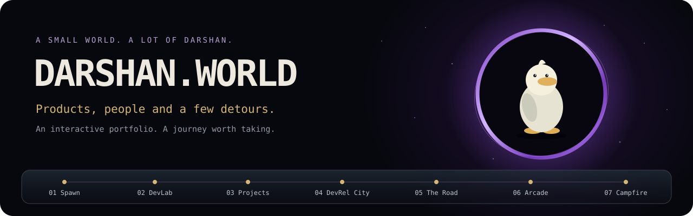

  
  <h1>DARSHAN.WORLD</h1>
  
<strong>One developer. Seven worlds. A duck with opinions.</strong>

  
A cinematic, interactive portfolio by <strong>Darshan Krishna N</strong>. Travel through the products I build, the communities I bring together, and the places I go to reset.

  

    <a href="#the-journey">Explore the worlds</a> &nbsp; / &nbsp;
    <a href="#quick-start">Run locally</a> &nbsp; / &nbsp;
    <a href="#make-it-yours">Edit the experience</a> &nbsp; / &nbsp;
    <a href="#connect">Connect</a>
  

  
<code>React 19</code> &nbsp; <code>TypeScript</code> &nbsp; <code>Three.js</code> &nbsp; <code>React Three Fiber</code> &nbsp; <code>Vite 8</code> &nbsp; <code>Web Audio</code>

<blockquote>
  
“I'm Darshan Krishna, a developer, community builder and DevRel enthusiast who loves turning technology into experiences people can understand, use and rally around.”

</blockquote>

This portfolio is a small playable world. Scrolling moves a camera through connected environments. Professional information stays accessible through a world map, direct chapter controls and a quick briefing. <strong>Gundu</strong>, an original 3D duck, comes along as navigator, occasional narrator and self-appointed co-founder.

<table>
  <tr>
    <td width="50%" valign="top">
      <h3>The work</h3>
      
<strong>Data Quality &amp; Governance Analyst I</strong> JLL Technologies · August 2024–present

      
Python, SQL, PySpark, data-quality automation, Databricks validation and dashboard testing.

      
Working toward Developer Relations and Developer Advocacy while building technical products and a path toward solo entrepreneurship.

    </td>
    <td width="50%" valign="top">
      <h3>The people</h3>
      
<strong>Founder, KrowdKraft</strong> A developer community in Bengaluru.

      
<strong>1,400+</strong> members · <strong>30+</strong> events <strong>5,000+</strong> developers reached · <strong>15+</strong> talks <strong>3,000+</strong> students and faculty trained

      
AlgoBharat Regional Ambassador, TigerGraph Bengaluru Community Lead and Postman Captain.

    </td>
  </tr>
</table>

<h2>The journey</h2>

<table>
  <thead><tr><th>Chapter</th><th>Inside the world</th><th>What to explore</th></tr></thead>
  <tbody>
    <tr><td><strong>00 · Entry</strong></td><td>A glowing Earth horizon, an orbiting satellite, stars and occasional meteor trails.</td><td>Meet Darshan and Gundu. Begin the journey, or explore illustrated lightweight worlds.</td></tr>
    <tr><td><strong>01 · Spawn</strong></td><td>A dark space with a spinning purple portal.</td><td>Meet the human behind the ideas, read the profile and open the quick briefing.</td></tr>
    <tr><td><strong>02 · DevLab</strong></td><td>A furnished workstation under a warm pendant lamp.</td><td>Explore skills, current work and AI-assisted development workflows.</td></tr>
    <tr><td><strong>03 · Projects</strong></td><td>Three circular product displays in a vaulted gallery.</td><td>Switch products and walk through their problems, systems and capabilities.</td></tr>
    <tr><td><strong>04 · DevRel City</strong></td><td>A tiered auditorium with a KrowdKraft stage.</td><td>Discover community achievements, speaking, training and ecosystem roles.</td></tr>
    <tr><td><strong>05 · The Road</strong></td><td>A long forest road with the actual Yezdi Adventure 350.</td><td>Take the midnight Bengaluru–Udupi ride or reset at Vatadahosahalli Lake.</td></tr>
    <tr><td><strong>06 · Arcade</strong></td><td>A dim gaming room with official trailers and an anime archive.</td><td>Play a reaction side quest. Meet <code>BotLifeMatters</code>. Browse three favourite anime.</td></tr>
    <tr><td><strong>07 · Campfire</strong></td><td>Firelight, a detailed moon, stars and quiet nature.</td><td>Pull up a seat, open the resume or start a conversation.</td></tr>
  </tbody>
</table>

<h3>Three products, explained through interaction</h3>

<table>
  <thead><tr><th>Product</th><th>Purpose</th><th>The interactive story</th></tr></thead>
  <tbody>
    <tr><td><strong>SAHAY</strong></td><td>AI-powered procurement and business operations for Indian MSMEs.</td><td>Requirement → supplier discovery → multilingual negotiation → landed-cost comparison → human approval.</td></tr>
    <tr><td><strong>ZUIK</strong></td><td>Intent-based DeFi automation on Algorand.</td><td>Natural-language intent → visual workflow → safety preview → wallet authorization → atomic execution.</td></tr>
    <tr><td><strong>SWYFTPAY</strong></td><td>Agent payment infrastructure for the open web.</td><td>HTTP 402 → payment challenge → spending policy → Algorand settlement → request continuation.</td></tr>
  </tbody>
</table>

The walkthroughs explain the products. They do not make live vendor calls, connect wallets or execute payments.

  
<strong>Beyond the work</strong>

  
Long rides, beaches, hills, waterfalls and rivers. Current games: Mobile Legends: Bang Bang and PUBG. All-time favourite: CS:GO.

  
Probably 100+ anime watched. Three favourites: <strong>One Piece</strong>, <strong>Akame ga Kill!</strong> and <strong>Hunter × Hunter</strong>.

  
Former ecosystem roles include Arbitrum Ambassador and Program Manager at HerAura Community.

<h2>Quick start</h2>

<strong>Requirements:</strong> Node.js 24 (matching CI) and npm. No API keys, database or backend service are required.

<pre><code>git clone https://github.com/DarshanKrishna-DK/DarshanKrishna-DK.github.io.git
cd DarshanKrishna-DK.github.io
npm ci
npm run dev</code></pre>

Open the local URL printed by Vite. On Windows PowerShell, use <code>npm.cmd</code> if script execution policy blocks <code>npm</code>.

<table>
  <thead><tr><th>Command</th><th>Purpose</th></tr></thead>
  <tbody>
    <tr><td><code>npm run dev</code></td><td>Prepare optimized portrait/bike images and start the development server.</td></tr>
    <tr><td><code>npm test</code></td><td>Run the regression suite with Vitest.</td></tr>
    <tr><td><code>npm run build</code></td><td>Prepare assets, check TypeScript and build the static site into <code>dist/</code>.</td></tr>
    <tr><td><code>npm run preview</code></td><td>Serve the production build locally after building it.</td></tr>
    <tr><td><code>npm run assets</code></td><td>Regenerate optimized images without starting a server.</td></tr>
  </tbody>
</table>

CI runs tests and the production build, then uploads <code>dist/</code> as an artifact. <strong>The workflow does not deploy.</strong>

<h2>Controls &amp; comfort</h2>

<table>
  <thead><tr><th>Action</th><th>Control</th></tr></thead>
  <tbody>
    <tr><td>Travel continuously</td><td>Mouse wheel, trackpad or touch swipe</td></tr>
    <tr><td>Move between chapters</td><td>Previous/next buttons, arrow keys or Page Up / Page Down</td></tr>
    <tr><td>Jump to a world</td><td>World map, chapter dots or a chapter URL fragment</td></tr>
    <tr><td>Open the map</td><td>Map button or <kbd>M</kbd></td></tr>
    <tr><td>Close a dialog</td><td>Close button or <kbd>Esc</kbd></td></tr>
    <tr><td>Control sound</td><td>Global mute button; volume slider in the world map</td></tr>
    <tr><td>Reduce motion or rendering cost</td><td>World map settings; system reduced-motion preference is respected</td></tr>
  </tbody>
</table>

Cinematic mode is the default. Lightweight mode preserves the content and 3D companion where WebGL is available. Graphics failure falls back to readable content. Reduced motion uses stable chapter viewpoints instead of camera flights.

  
<strong>Sound design</strong>

  <ul>
    <li>Sound starts only after the visitor's entry gesture or sound-control click. Direct chapter links open at that chapter, initially muted.</li>
    <li>Spawn, DevLab, Projects and DevRel City share one original score.</li>
    <li>The auditorium applauds once after a three-second stay. Leaving early cancels the cue.</li>
    <li>Road uses breeze, birds and landscape-specific natural ambience.</li>
    <li>Campfire uses burning wood, light wind and distant insects, with no musical layer.</li>
    <li>Arcade and the anime archive have their own synthesized motifs. Embedded trailers stay muted.</li>
    <li>World mixes and recording loop boundaries crossfade. Hidden tabs pause audio.</li>
  </ul>

  
<strong>Gundu's behaviour</strong>

  
Gundu tracks the cursor, introduces himself at boot, walks while travelling, quacks when clicked, and reacts to each world. Idle actions include waving, dancing and sleeping with ZZZ symbols. The Road gets a helmet; the auditorium gets a microphone; Campfire gets a warming pose.

  
Dialogue and state transitions are editable independently of the model.

<h2>Maintain the experience</h2>

<table>
  <thead><tr><th>Change</th><th>Start here</th></tr></thead>
  <tbody>
    <tr><td>Profile, role, socials, resume, community facts</td><td><a href="src/data/profile.ts"><code>src/data/profile.ts</code></a></td></tr>
    <tr><td>Products and interactive walkthroughs</td><td><a href="src/data/projects.ts"><code>src/data/projects.ts</code></a></td></tr>
    <tr><td>Chapter names and navigation</td><td><a href="src/data/worlds.ts"><code>src/data/worlds.ts</code></a></td></tr>
    <tr><td>Gundu dialogue and actions</td><td><a href="src/data/gundu.ts"><code>src/data/gundu.ts</code></a> · <a href="src/lib/companion.ts"><code>src/lib/companion.ts</code></a></td></tr>
    <tr><td>Boot copy</td><td><a href="src/data/boot.ts"><code>src/data/boot.ts</code></a></td></tr>
    <tr><td>Music and environmental mixing</td><td><a href="src/data/soundscapes.ts"><code>src/data/soundscapes.ts</code></a> · <a href="src/lib/natureAudio.ts"><code>src/lib/natureAudio.ts</code></a></td></tr>
    <tr><td>Camera positions, chapter lengths and portal thresholds</td><td><a href="src/lib/routeLayout.ts"><code>src/lib/routeLayout.ts</code></a> · <a href="src/lib/journey.ts"><code>src/lib/journey.ts</code></a></td></tr>
    <tr><td>Official trailer IDs and screen behaviour</td><td><a href="src/scene/MediaScreen.tsx"><code>src/scene/MediaScreen.tsx</code></a></td></tr>
    <tr><td>Favourite anime and official image credits</td><td><a href="src/components/AnimeArchive.tsx"><code>src/components/AnimeArchive.tsx</code></a></td></tr>
  </tbody>
</table>

  
<strong>Replace images without changing the scene</strong>

  <ul>
    <li><strong>Portrait:</strong> <code>assets/dk.png</code>. Transparent derivative: <code>assets/dk-cutout.png</code>. Preserve the original.</li>
    <li><strong>Motorcycle:</strong> <code>assets/Isolated Black Yezdi Adventure Motorcycle.png</code>. This is Darshan's actual Yezdi Adventure 350.</li>
    <li><strong>Project logos:</strong> replace <code>sahay.png</code>, <code>zuik.png</code> and <code>swyftpay.png</code> in <a href="public/assets/project-logos/">public/assets/project-logos/</a>. Square PNGs with transparent padding work best. Builds preserve these files.</li>
    <li><strong>Community photos:</strong> add files to <a href="public/assets/community/">public/assets/community/</a>, then configure <code>communityMemories</code> in <code>profile.ts</code>. Empty configuration does not invent events.</li>
    <li><strong>Resume:</strong> update <code>profile.resumeUrl</code>. The current interaction opens the supplied Google Drive viewer; no local PDF is needed.</li>
  </ul>

  
<strong>Repository structure &amp; Git hygiene</strong>

  <pre><code>assets/                 Preserved portrait, cutout and actual motorcycle
public/assets/          Shipped audio, project marks, anime/game artwork
src/components/         Readable UI, dialogs and interactive explanations
src/data/               Editable content and world configuration
src/lib/                Journey, companion state, audio and domain helpers
src/scene/              Three.js environments, lighting and Gundu
src/styles/             Responsive presentation and visual refinements
scripts/                Repository-local asset preparation
docs/                   Architecture, design, verification and asset credits
.github/workflows/      Test/build CI
dist/                   Generated production output; ignored
artifacts/              Local QA captures and source downloads; ignored</code></pre>
  
Dependencies, build output, caches, local environment files, editor settings, agent scratch files, generated delivery images and QA artifacts are ignored. Runtime media, source code, tests, original build inputs and <code>package-lock.json</code> belong in Git.

  
Older source illustrations and superseded design notes are retained locally but excluded from the repository's publishable file set.

<h2>Under the hood</h2>

React owns the accessible interface; React Three Fiber coordinates the Three.js scenes. A single normalized journey drives camera movement, chapter selection and contextual audio. A separate canvas keeps Gundu present across environments.

Rendering uses nearby-world culling, instanced crowds and foliage, a capped pixel ratio, a bounded frame cadence and shared reflection maps. The project uplights illuminate actual materials; moon detail is baked into a small procedural texture. No heavy post-processing chain is required.

Official trailers preload during the Road and fade in after confirmed playback. Publisher artwork stays visible while loading or when playback fails. Video startup remains subject to YouTube, browser and network conditions.

  <a href="docs/ARCHITECTURE.md"><strong>Architecture</strong></a> &nbsp; · &nbsp;
  <a href="DESIGN.md"><strong>Design system</strong></a> &nbsp; · &nbsp;
  <a href="docs/IMPLEMENTATION_STATUS.md"><strong>Verification notes</strong></a> &nbsp; · &nbsp;
  <a href="docs/ASSETS.md"><strong>Asset provenance</strong></a> &nbsp; · &nbsp;
  <a href="docs/ARCADE_MEDIA.md"><strong>Arcade media</strong></a> &nbsp; · &nbsp;
  <a href="docs/ANALYTICS.md"><strong>Analytics &amp; privacy</strong></a>

Third-party artwork, videos, fonts and recordings retain their respective rights and licenses. Source credits are documented in the asset notes. Project repository links are intentionally absent from the visitor experience.

  <h2>Good things start with a hello.</h2>
  
Developer relations. Products. Communities. An idea worth building together.

  

    <a href="mailto:darshankrishna2k2@gmail.com"><strong>Let's talk</strong></a> &nbsp; / &nbsp;
    <a href="https://www.linkedin.com/in/darshan-krishna-dk/">LinkedIn</a> &nbsp; / &nbsp;
    <a href="https://github.com/DarshanKrishna-DK">GitHub</a> &nbsp; / &nbsp;
    <a href="https://www.instagram.com/cryptech_dk/">Instagram</a> &nbsp; / &nbsp;
    <a href="https://x.com/CrypTech_DK">X</a> &nbsp; / &nbsp;
    <a href="https://drive.google.com/file/d/1OUpDvnZUzZc_PHhuugRdXb00gtgxOoNJ/view?usp=drive_link">View resume</a>
  

  Made in Bengaluru. Accompanied by Gundu.

